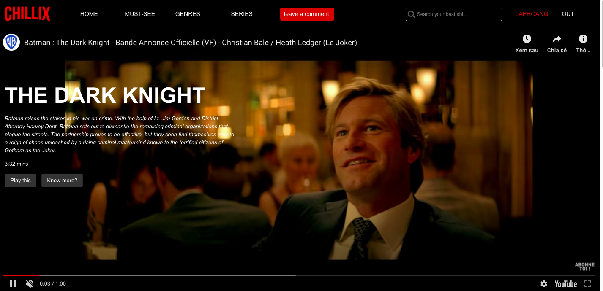
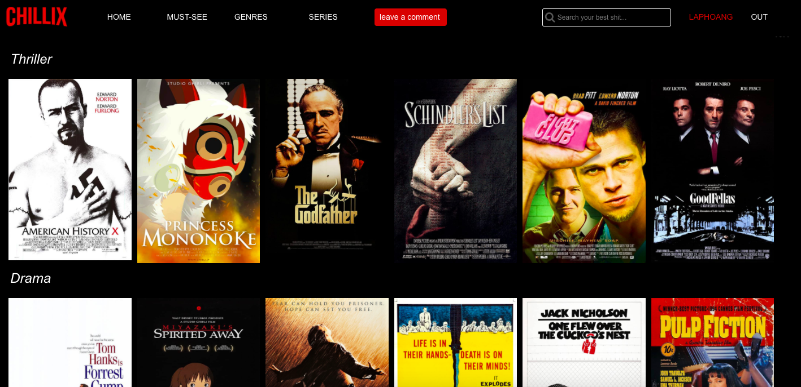

# Chillix
BeCode's Getflix project

- Repository: PHP
- Type of Challenge:  `Consolidation`
- Duration: `10 days`
- Team challenge : 
  - frontend
  - backend
  - project management
  
## Our team & what we do:

* [Lap hoang](https://github.com/lap-hoang24) 

      * GithubMaster and project manager
      * Created the Databases and the Trello 
      * Finalizing al the details
      
* [Masato Deweerdt](https://github.com/masatoDeweerdt) 

      * Front-end, HTML5, CSS and Bootstrap
      * Design and thumbnails
      * Php password recovery
          
* [Bembassat Frédéric](https://github.com/Fbembassat)

      * Back-end PHP Back office for user and comment management (CRUD)
      * Deployement of the site
      * Creation of our worktchat
      
* [Melissa Fruit](https://github.com/Melissa-Fruit)

      * Back-end PHP and MySQL Sign In, Sign Up and comment section
      * Readme
      * Newsletter with mailchimp
     
**Each member of the team worked on the whole project, we helped and learned from each other.** 
  
#### Access to Chillix from the beginning: http://chillix.epizy.com/

#### Access directly to Chillix mainpage: http://chillix.epizy.com/main.php/

## Mission objectives 

Putting into practice wat we learned 

## The Mission

In this exercise we must create a Streaming site in html / css, javascript and php.

We get inspired by Netflix.
The goal is to display a catalog of movies. 

### Must-have features

- A session system: registration, connection / disconnection.
- Different rights: registrants have the right to comment on the content. You can add other rights depending on the different types of users.
- Include a search bar and sort by filters
- Make a secure code
- Deploy the site. PHP is not supported by github, find free alternatives.

### Nice-to-have features

- Management of lost passwords.
- Back office for user and comment management (CRUD).
- Create a page or section that displays the top movies with the movie db API.
- Integrate a newsletter with Mailchimp.

### Miscellanous information

- The videos are not hosted, it are a simple link to the Youtube trailer.

## Evaluation criterias

| Criteria       | Indicator                                                    | Yes/No |
| -------------- | ------------------------------------------------------------ | ------ |
| 1. Is complete | The team has realized all must-have features.                |  Yes   |
|                | There is a published GitHub page available.                  |  Yes   |
|                | The code is well indented and commented                      |  Yes   |
|                | The readme is clean and complete                             |  Yes   |
|                | At least one Nice-to-have features is ok                     |  Yes   |
| 2. Is Correct  | The HTML and CSS pass the W3C Validation tool.               |  Yes   |
|                | The lighthouse test scores 90 at least on Performance, Best Practices, Accessibility and SEO. |        |
|                | The code is well indented and commented                      |  no    |

## Credits

- Royalty free picture for the background from wallpaperflare.
- Tutorial "Create a Netflix clone from Scratch- JavaScript PHP + MySQL" from Reece Kenney.
- Stackoverflow.
- w3schools.
- PHP official documentation.
- Movie database from IMDb.

## A few screenshots from website

#### Landing page

#### Main streaming page

#### Movies categories

#### Databases relations

